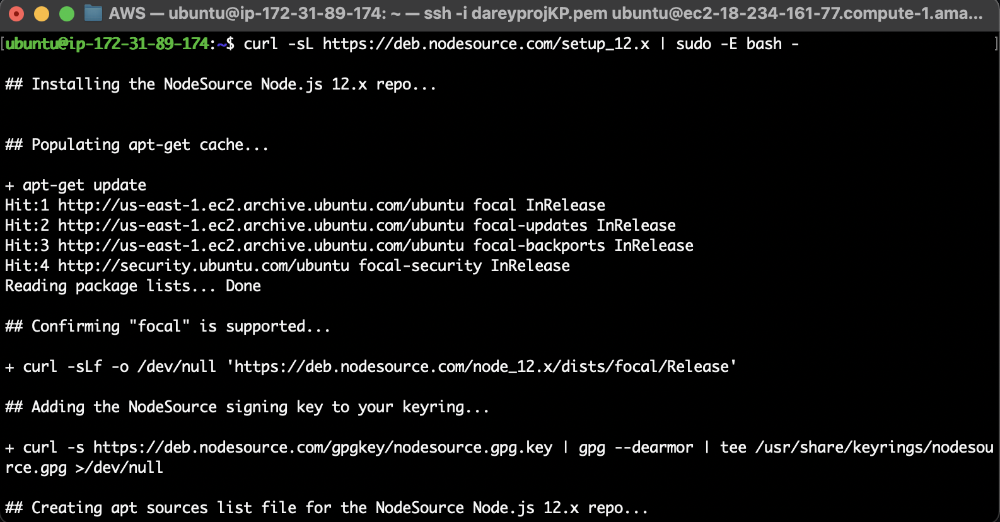
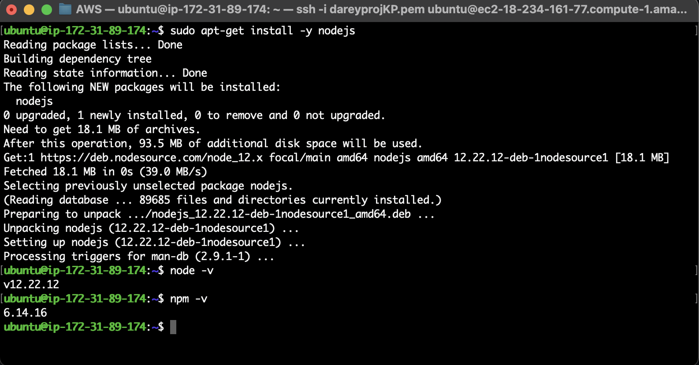
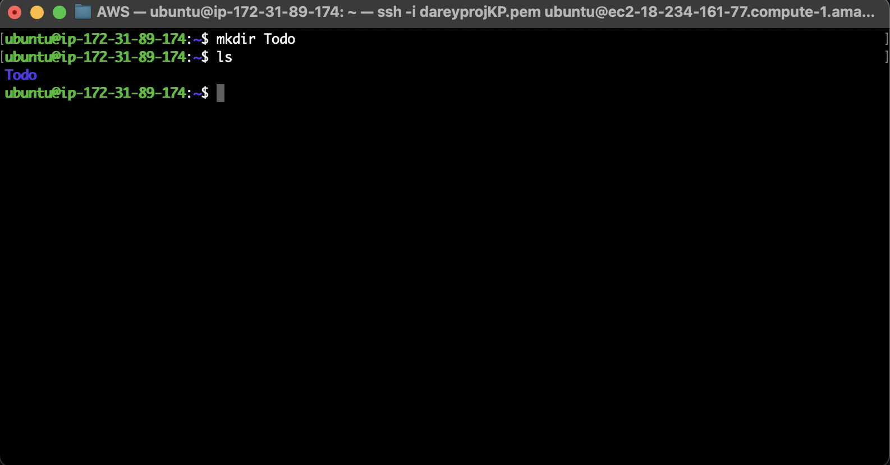
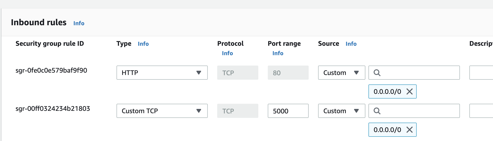
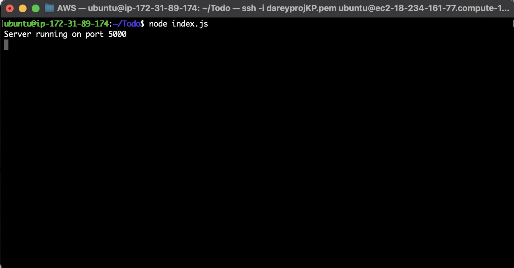
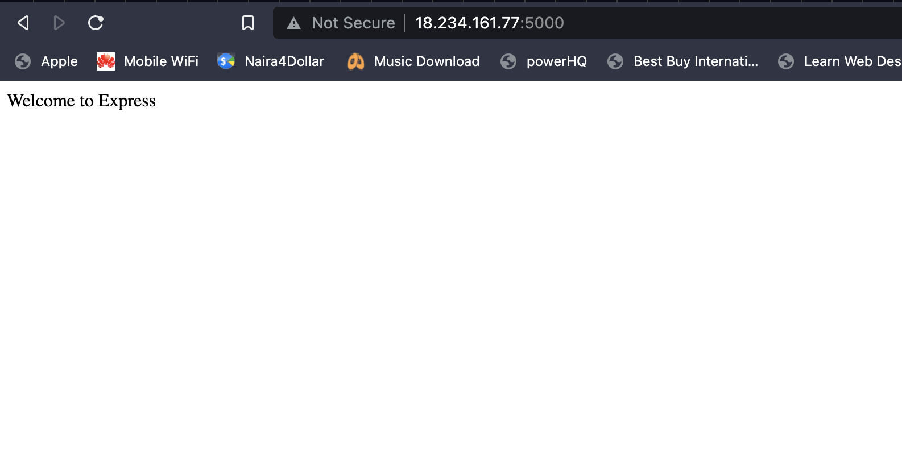

# MERN STACK IMPLEMENTATION

## SIMPLE TO-DO APPLICATION ON MERN WEB STACK

===============

In this project, I implemented a web solution based on MERN stack in AWS Cloud.

MERN Web stack consists of following components:

1. **MongoDB:** A document-based, No-SQL database used to store application data in a form of documents.
2. **ExpressJS:** A server side Web Application framework for Node.js.
3. **ReactJS:** A frontend framework developed by Facebook. It is based on JavaScript, used to build User Interface (UI) components.
4. **Node.js:** A JavaScript runtime environment. It is used to run JavaScript on a machine rather than in a browser.

## STEP 1: BACKEND CONFIGURATION

===============

Update ubuntu

```
sudo apt update
```

Upgrade ubuntu

```
sudo apt upgrade
```

Get the location of Node.js software from Ubuntu repositories.

```
curl -fsSL https://deb.nodesource.com/setup_18.x | sudo -E bash -
```




Install Node.js with the command below:

```
sudo apt-get install -y nodejs
```




The command above installs both nodejs and npm. NPM is a package manager for Node like apt for Ubuntu, it is used to install Node modules & packages and to manage dependency conflicts.

Verify the node installation with the command below:

```
node -v 
```

Verify the node installation with the command below:

```
npm -v 
```

Create a new directory for your To-Do project

```
mkdir Todo
```




Change your current directory to the newly created one:

```
cd Todo
```

Next, you will use the command `npm init` to initialise your project, so that a new file named `package.json` will be created. This file will normally contain information about your application and the dependencies that it needs to run. Follow the prompts after running the command. You can press Enter several times to accept default values, then accept to write out the `package.json` file by typing `yes`.

```
npm init
```

Run the command ls to confirm that you have `package.json` file created.

Next, we will Install `ExpressJs` and create the `Routes` directory.

## STEP 1.1: INSTALL EXPRESSJS

===============


Remember that Express is a framework for Node.js, therefore a lot of things developers would have programmed is already taken care of out of the box. Therefore it simplifies development, and abstracts a lot of low level details. For example, Express helps to define routes of your application based on HTTP methods and URLs.

To use express, install it using npm:

```
npm install express
```

Now create a file `index.js` with the command below:

```
touch index.js
```

Run ls to confirm that your index.js file is successfully created

Install the dotenv module:

```
npm install dotenv
```

Open the index.js file with the command below:

```
vim index.js
```

Type the code below into it and save. 

```
const express = require('express');
require('dotenv').config();

const app = express();

const port = process.env.PORT || 5000;

app.use((req, res, next) => {
res.header("Access-Control-Allow-Origin", "\*");
res.header("Access-Control-Allow-Headers", "Origin, X-Requested-With, Content-Type, Accept");
next();
});

app.use((req, res, next) => {
res.send('Welcome to Express');
});

app.listen(port, () => {
console.log(`Server running on port ${port}`)
});
```

We had specified to use port 5000 in the code. This will be required later when we go on the browser.

Create an inbound rule to open TCP port 5000: 




Now it is time to start our server to see if it works. Open your terminal in the same directory as your index.js file and type:

```
node index.js
```




If every thing goes well, you should see Server running on port 5000 in your terminal.



There are three actions that our To-Do application needs to be able to do:

1. Create a new task
2. Display list of all tasks
3. Delete a completed task


Each task will be associated with some particular endpoint and will use different standard HTTP request methods: POST, GET, DELETE.

For each task, we need to create routes that will define various endpoints that the To-do app will depend on. So let us create a folder routes:

```
mkdir routes
```

Change directory to routes folder:

```
cd routes
```

